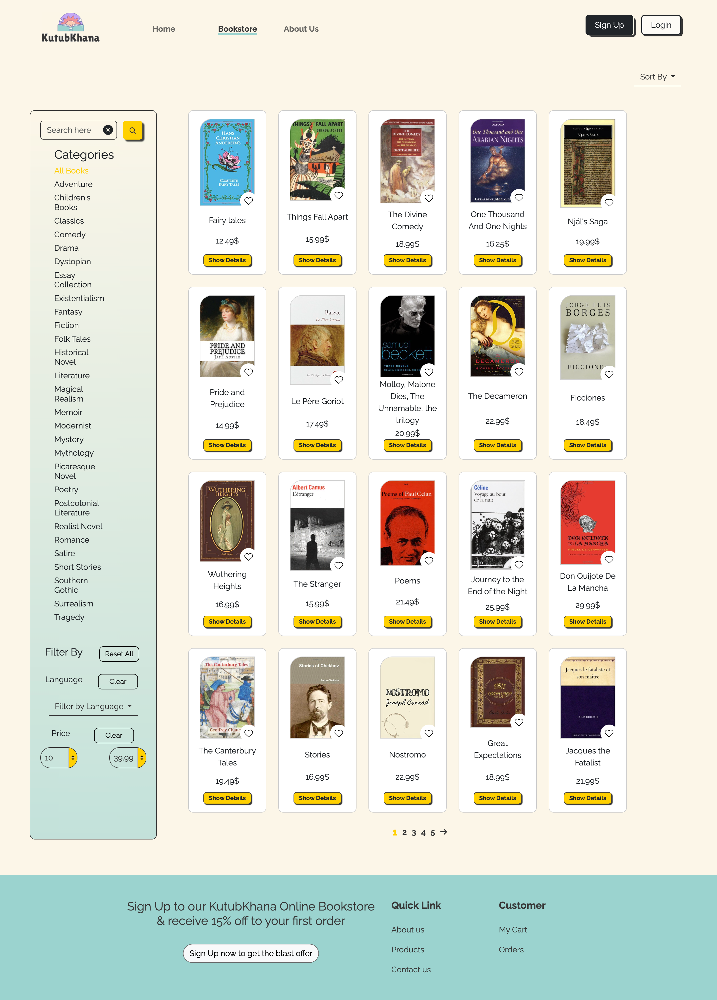
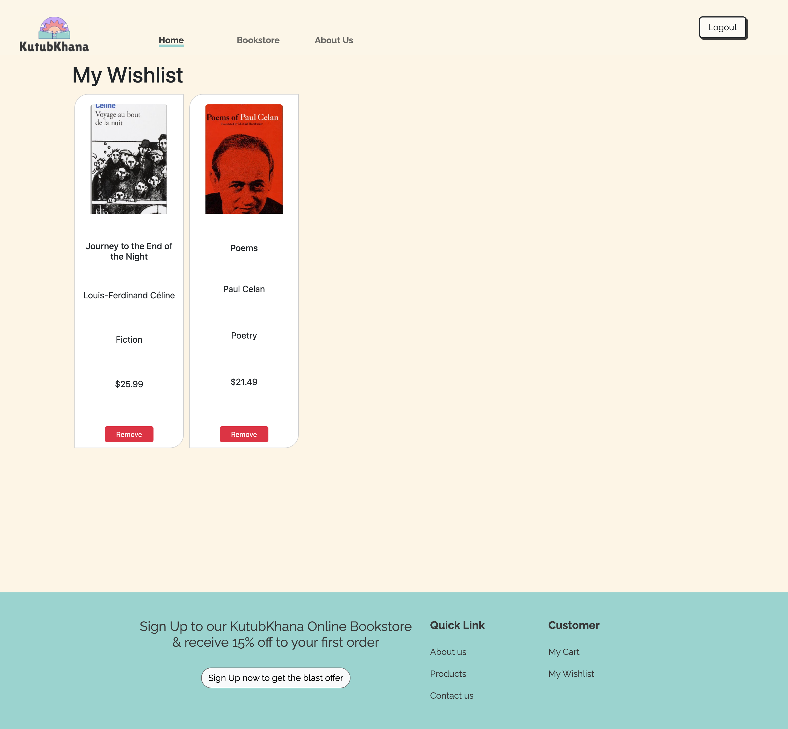
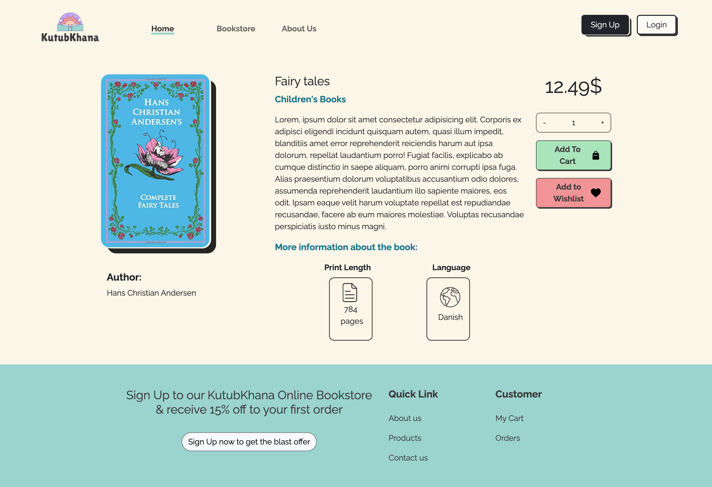
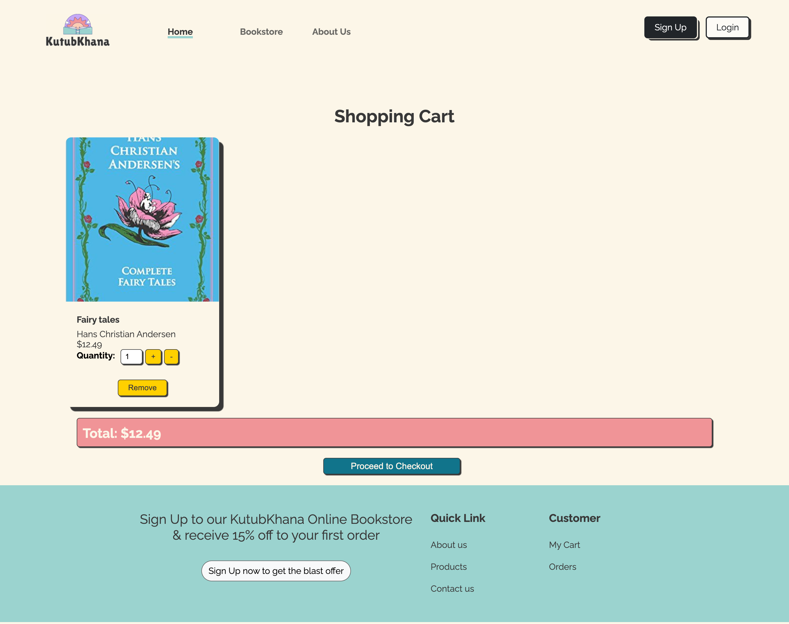
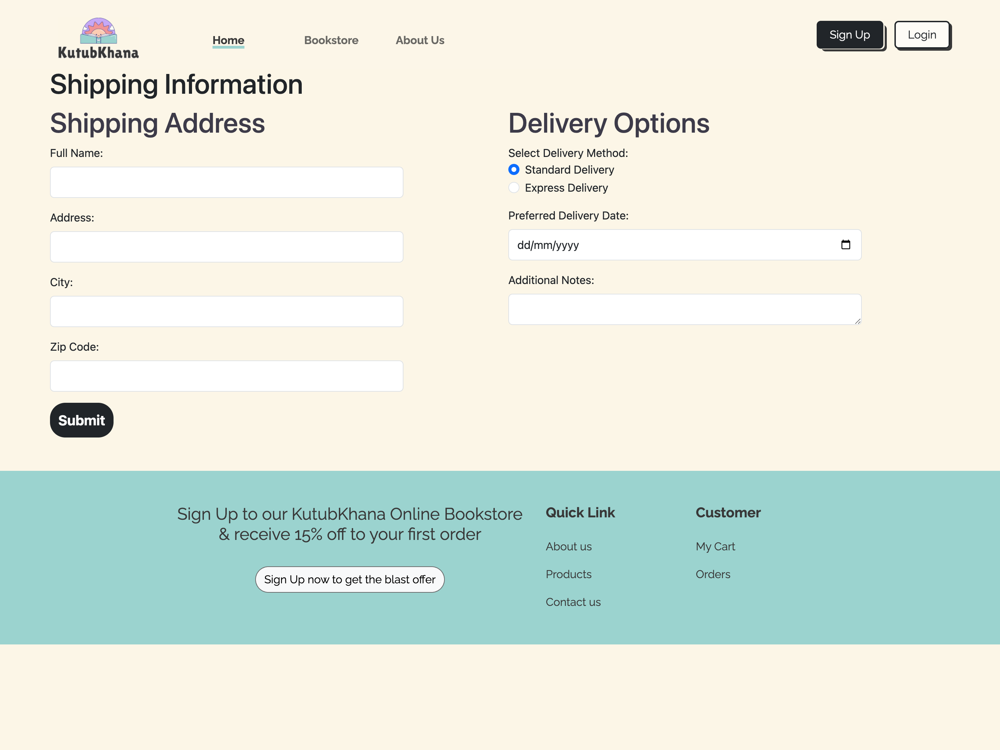
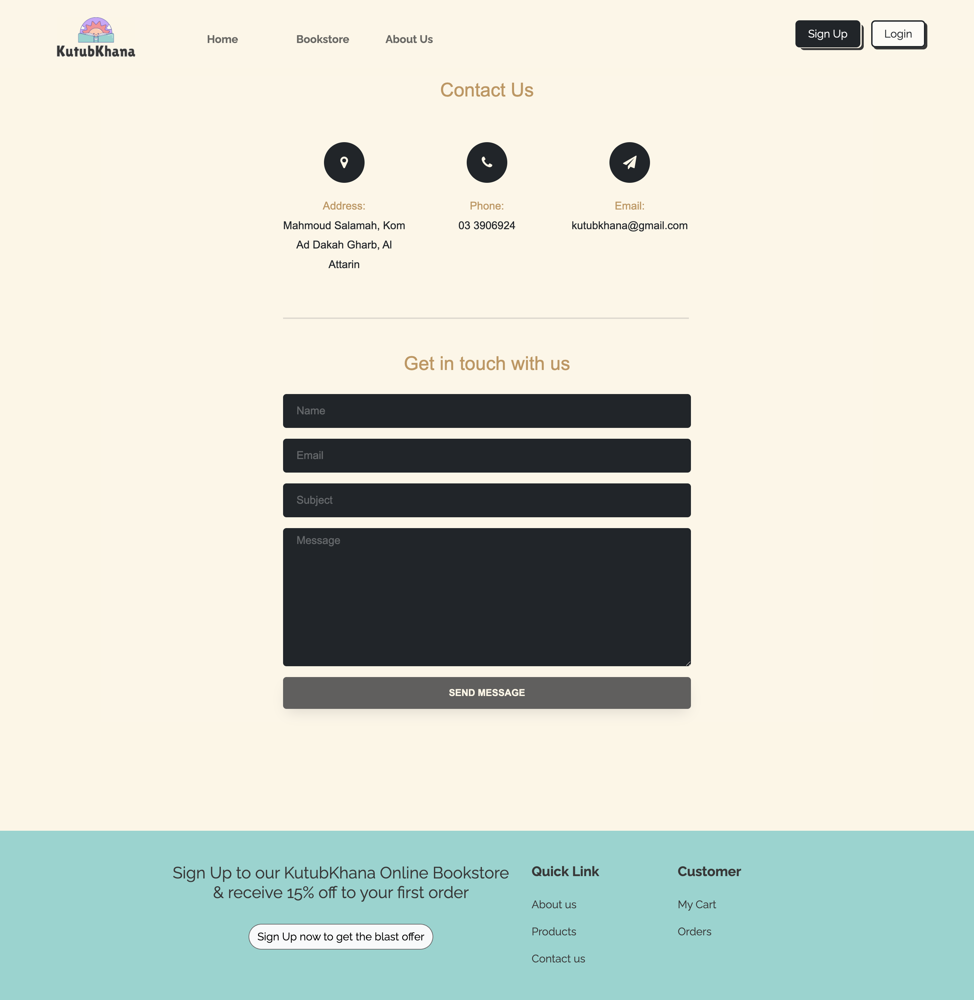
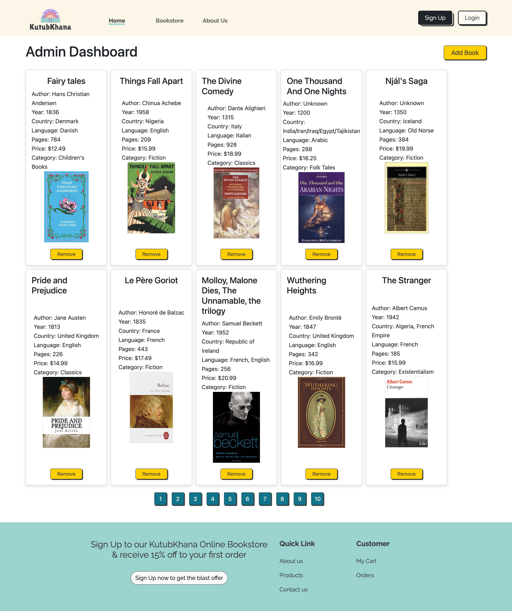

# KutubKhana Online Bookstore Platform

Welcome to the GitHub repository for KutubKhana's Online Bookstore Platform. This project is a lightweight, fast, and easily navigable website built entirely with Vanilla JavaScript, HTML, and CSS. Our goal is to provide an effortless online browsing experience for our customers, akin to the welcoming and intimate atmosphere of our physical bookstore.

## Table of Contents

- [Introduction](#introduction)
- [Features](#features)
- [Screens](#screens)
- [Getting Started](#getting-started)
- [How to Use](#how-to-use)
- [Contributing](#contributing)
- [License](#license)

## Introduction

KutubKhana Online Bookstore Platform is a web application that aims to recreate the charm and simplicity of a traditional bookstore in an online environment. Our focus is on delivering a seamless browsing experience for users to discover and explore a wide range of books.

## Features

- **Lightweight and Fast:** The platform is designed to be fast-loading and lightweight, ensuring a smooth and responsive user experience.

- **User-Friendly Interface:** The website features an intuitive and user-friendly interface, making it easy for customers to browse, search, and find their favorite books.

- **Book Categories:** Books are organized into categories, making it convenient for users to explore specific genres and topics.

- **Search Functionality:** A powerful search feature allows users to quickly find books based on titles, authors, or keywords.

- **Responsive Design:** The platform is built with a responsive design, ensuring a consistent and enjoyable experience across various devices and screen sizes.

## Screens

Here are some screenshots showcasing the functionalities of the KutubKhana Online Bookstore Platform:

0. **Register and Login**
   
   

1. **Homepage:**
   

2. **Book Categories:**
   

3. **Wishlist Functionality:**
   

4. **Book Details:**
   

5. **Adding to Cart:**
   

6. **Shipping Process:**
   

7. **Cart Success Process:**
   

8. **About Us Process:**
   

9. **Contact Us Process:**
   

10. **Admin Dashboard Process:**
    

Feel free to explore the platform through these screenshots!

## Getting Started

To get started with the KutubKhana Online Bookstore Platform, follow these steps:

1. **Clone the Repository:**

   ```bash
   git clone https://github.com/MalakNasser/KutubKhanah
   ```

2. **Open the Project:**

   ```bash
   cd KutubKhanah
   ```

3. **Open `index.html` in your Browser:**
   Open the `index.html` file in your preferred web browser to explore the online bookstore platform.

## How to Use

1. **Explore Book Categories:**
   Navigate through different book categories to discover a diverse collection.

2. **Search for Books:**
   Use the search bar to find specific books based on titles, authors, or keywords.

3. **View Book Details:**
   Click on a book to view detailed information, including the title, author, description, and cover image.

4. **Add to Cart:**
   Add your favorite books to the cart for a seamless checkout experience.

5. **Checkout:**
   Complete your purchase by following the simple checkout process.

## Contributing

We welcome contributions from the community to enhance the KutubKhana Online Bookstore Platform. If you'd like to contribute, please follow our [contribution guidelines](CONTRIBUTING.md).

## License

This project is licensed under the [MIT License](LICENSE), which means you are free to use, modify, and distribute the code for personal or commercial purposes.

Thank you for exploring KutubKhana Online Bookstore Platform! Happy reading! 📚✨
