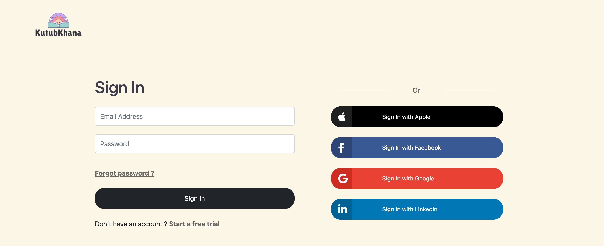
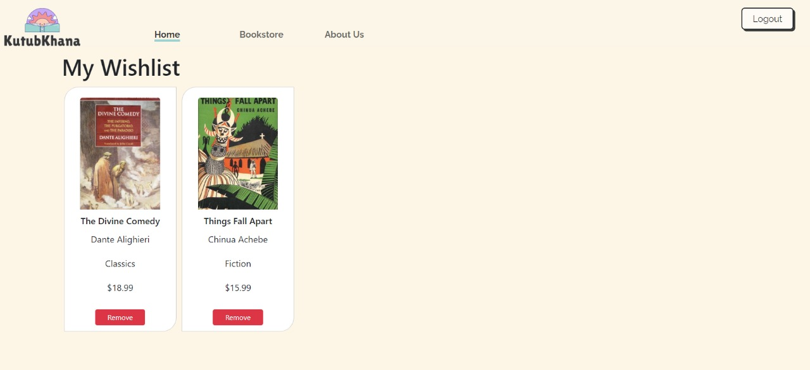
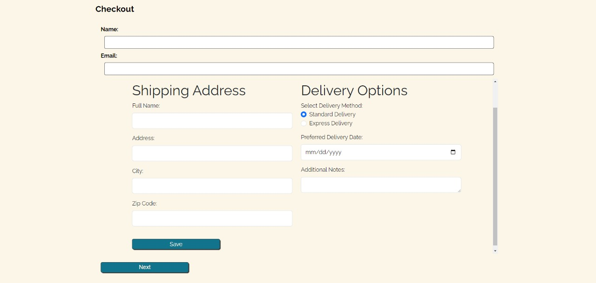
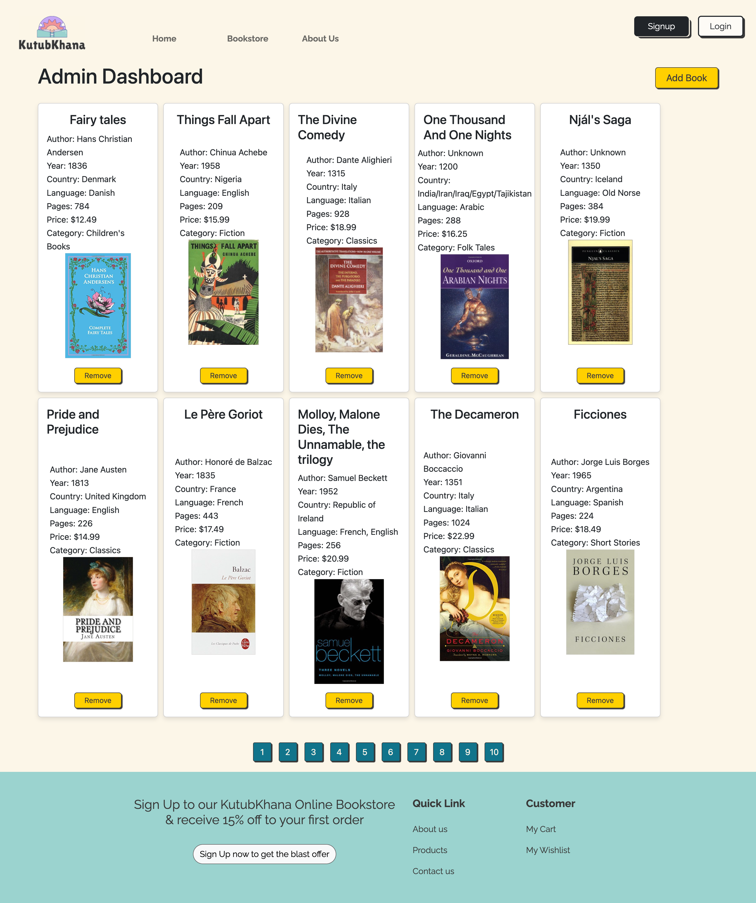

# KutubKhana Online Bookstore Platform

Welcome to the GitHub repository for KutubKhana's Online Bookstore Platform. This project is a lightweight, fast, and easily navigable website built entirely with Vanilla JavaScript, HTML, and CSS. Our goal is to provide an effortless online browsing experience for our customers, akin to the welcoming and intimate atmosphere of our physical bookstore.

## Table of Contents

- [Introduction](#introduction)
- [Features](#features)
- [Screens and Demo](#screens)
- [Getting Started](#getting-started)
- [How to Use](#how-to-use)

## Introduction

KutubKhana Online Bookstore Platform is a web application that aims to recreate the charm and simplicity of a traditional bookstore in an online environment. Our focus is on delivering a seamless browsing experience for users to discover and explore a wide range of books.

## Features

- **Lightweight and Fast:** The platform is designed to be fast-loading and lightweight, ensuring a smooth and responsive user experience.

- **User-Friendly Interface:** The website features an intuitive and user-friendly interface, making it easy for customers to browse, search, and find their favorite books.

- **Book Categories:** Books are organized into categories, making it convenient for users to explore specific genres and topics.

- **Search Functionality:** A powerful search feature allows users to quickly find books based on titles, authors, or keywords.

- **Responsive Design:** The platform is built with a responsive design, ensuring a consistent and enjoyable experience across various devices and screen sizes.

## Production Deployment

You can access the production deployment of KutubKhanah [here](https://malaknasser.github.io/KutubKhanah).

## Screens

Here are some screenshots showcasing the functionalities of the KutubKhana Online Bookstore Platform:

0. **Register and Login**
   
   

1. **Homepage:**
   

2. **Book Categories:**
   

3. **Wishlist Functionality:**
   

4. **Book Details:**
   

5. **Adding to Cart:**
   

6. **Shipping Process:**
   

7. **Cart Success Process:**
   

8. **About Us Process:**
   

9. **Contact Us Process:**
   

10. **Admin Dashboard Process:**
    
11. **Demo Video:**\
    

Feel free to explore the platform through these screenshots!

## Getting Started

To get started with the KutubKhana Online Bookstore Platform, follow these steps:

1. **Clone the Repository:**

   ```bash
   git clone https://github.com/MalakNasser/KutubKhanah
   ```

2. **Open the Project:**

   ```bash
   cd KutubKhanah
   ```

3. **Install JSON Server:**

Before running the JSON Server, you need to install it globally on your machine. If you haven't already installed JSON Server, you can do so using npm (Node Package Manager) by running the following command:

```bash
npm install -g json-server
```

4. **Start JSON Server:**

Once JSON Server is installed, navigate to the project directory if you're not already there and run the following command to start the server:

```bash
json-server --watch database/userData.json
```

5. **Open `index.html` in your Browser:**
   Open the `index.html` file in your preferred web browser to explore the online bookstore platform.

## How to Use

1. **Explore Book Categories:**
   Navigate through different book categories to discover a diverse collection.

2. **Search for Books:**
   Use the search bar to find specific books based on titles, authors, or keywords.

3. **View Book Details:**
   Click on a book to view detailed information, including the title, author, description, and cover image.

4. **Add to Cart:**
   Add your favorite books to the cart for a seamless checkout experience.

5. **Checkout:**
   Complete your purchase by following the simple checkout process.
